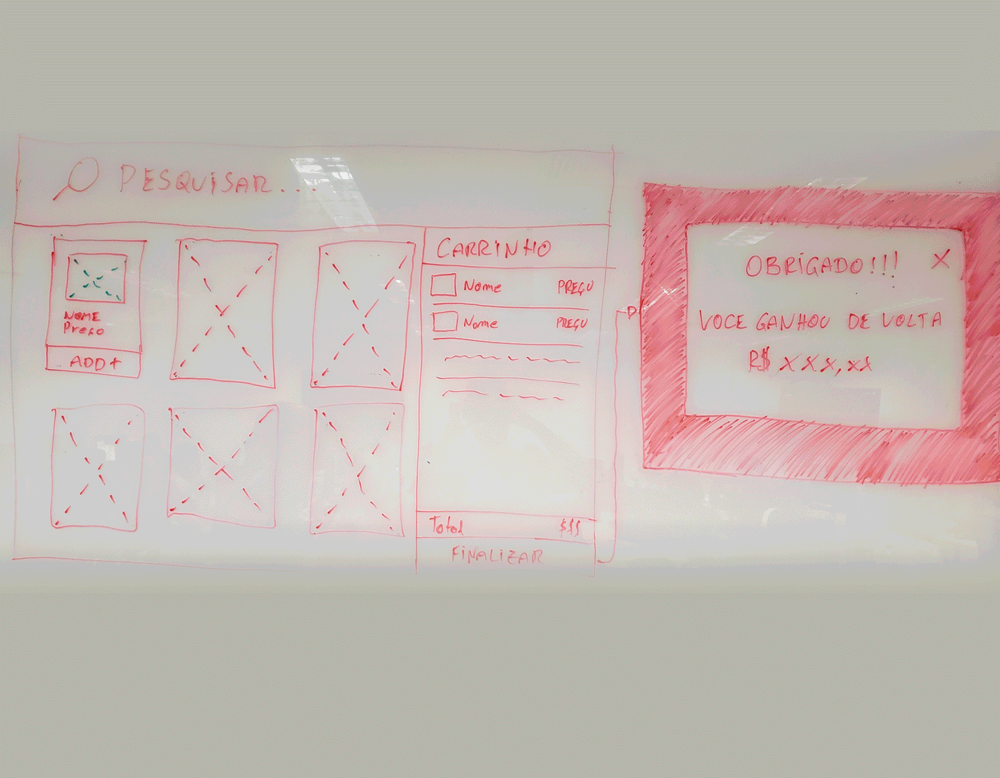

# B2W APP POKEMON



This project was bootstrapped with [Create React App](https://github.com/facebook/create-react-app) ❤️<br/>

Learn More:

- [Getting Started](#getting-started)
- [How to use](#how-to-use)
- [Technology](#technology)
- [How to run with docker](#how-to-run-with-docker)
- [How to run with yarn or npm](#how-to-run-with-yarn-or-npm)
- [How to run tests](#how-to-run-tests)
- [Author](#author)
- [License](#license)

# Getting Started

```

$ Git --version
>= v2.25

$ node --version
>= v12.14.1

```

# How to use

You can see this app at {url} or follow the [How to run with docker](#how-to-run-with-docker) or [How to run with yarn/npm](#how-to-run-with-yarn-npm) to run locally.

# Technology

- [PokeApi](https://pokeapi.co/)
- [React](https://reactjs.org/)
- [React Router](https://reacttraining.com/react-router/web/guides/quick-start)
- [Redux](https://redux.js.org/)
- [Styled Components](https://www.styled-components.com/)
- [ESLint](https://eslint.org/)
- [Babel](https://babeljs.io/)
- [Webpack](https://webpack.js.org/)
- [Node](https://nodejs.org/)
- [NPM](https://www.npmjs.com/)
- [Jest](https://jestjs.io/)
- [Enzyme](https://airbnb.io/enzyme/)
- [Docker](https://www.docker.com/)

# How to run with docker

- With [docker](https://docs.docker.com/install/ "docker") and [docker compose](https://docs.docker.com/compose/install/ "docker compose") installed, run the following:

```
git clone https://github.com/rafaelfigueiredo-l/b2w-test-pokemon
cd b2w-test-pokemon
cp .env-sample .env
cp app/.env-sample app/.env
cd app && yarn install
docker-compose up
```

After docker create containers you can access the app at:

- http://localhost:3000 (ghost)
- http://localhost:3001 (water)
- http://localhost:3002 (fire)

# How to run with yarn or npm

If you want to change theme you can change .env REACT_APP_POKEMON_THEME=ghost||water||fire

yarn:

```
git clone https://github.com/rafaelfigueiredo-l/b2w-test-pokemon
cd b2w-test-pokemon/app
yarn install
yarn start
```

npm:

```
git clone https://github.com/rafaelfigueiredo-l/b2w-test-pokemon
cd b2w-test-pokemon/app
npm install
npm start
```

# How to run tests

yarn:

```
cd app
yarn test
```

npm:
```
cd app
npm test
```

# Author

**Rafael Figueiredo** - [GitHub](https://github.com/rafaelfigueiredo-l/) | [Linkedin](https://www.linkedin.com/in/rafael-figueiredo-1a076a59/)

# License

This project is under the [MIT](LICENSE) license.
